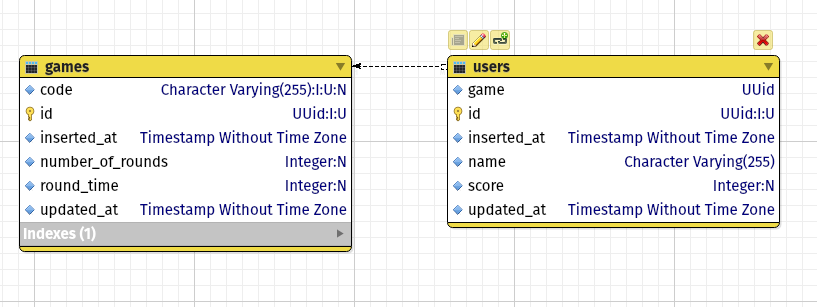

# Drawtoo

Drawtoo is going to be a hangman/like drawing videogame for 2+ players.
The objective of the game is to guess what the other participants are drawing in
a given amount of time, one letter at a time or multiple letters at a time.

## Game mechanics

The players will take turns in a round robin fashion. The participant will have
2 minutes to draw while the other participants can guess a word at a time. 
Failed guesses will highlight the matching letters with the current word.

The player will receive a proportional of points based on the remaining time and
the players that guessed correctly will receive a smaller points reward

The game will go on for 10 rounds (in the future it could be user selectable

## Stack

### Backend

The backend will be implemented in Elixir using the Phoenix framework. Persistance
will be implemented in PostgreSQL using the BJSON for drawing data. Communication
will be managed using websockets with the frontend application

#### Tables 

### Frontend

The frontend will be a ReactJS application using the Attrament library to manage
the user input and drawings. 

## Nice to have

* User selectable limit of rounds
* AI opponents
